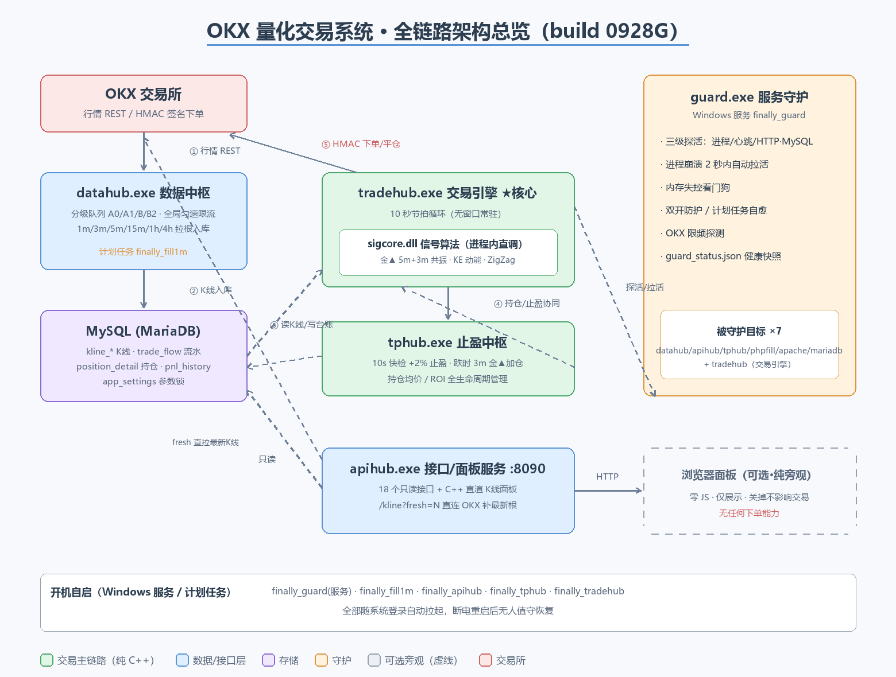
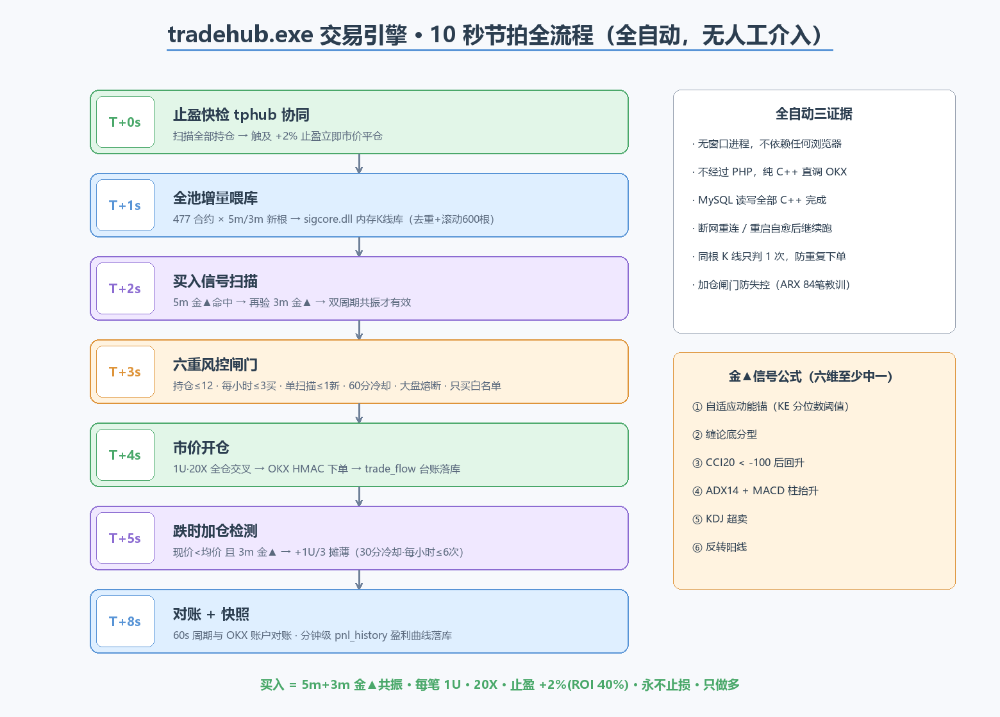
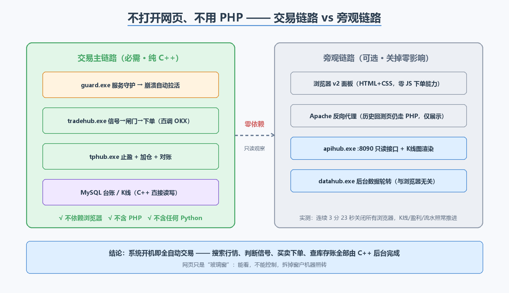

# OKX Quant Trading System (OKX 永续合约全自动量化交易系统)

一套部署于 Windows、对接 **OKX 永续合约**的**全自动量化交易系统**。核心采用 **C++ 组件化架构**：行情搜索、信号计算、买入卖出、止盈加仓、对账落库全部由 C++ 后台进程自动完成 —— **不依赖浏览器网页、交易链路零 PHP、零人工介入**。PHP 仅负责网页看板显示，网页是纯旁观者。

> 📐 **详细架构说明（图文）**：[docs/ARCHITECTURE.md](docs/ARCHITECTURE.md)

## 系统架构总览



| 组件 | 职责 |
|------|------|
| `tradehub.exe` | 交易引擎：10 秒节拍，买入扫描（5m+3m 金▲共振）、跌时加仓（3m 金▲）、对账、盈利快照 |
| `tphub.exe` | 止盈引擎：持仓 +2% 止盈快检，秒级响应 |
| `datahub.exe` | 数据中枢：全市场 477 合约 K 线分级轮转下载入库（3m/5m/15m/1h/4h） |
| `apihub.exe` | API 服务（:8090）：K 线 / 信号 / 持仓等 18 个 JSON 接口 + 内嵌 C++ 渲染网页面板 |
| `guard.exe` | 守护服务（Windows Service）：三级探活、崩溃 2 秒拉活、双开防护、计划任务自愈 |
| `sigcore.dll` | 信号算法库：金▲（KE=½mv² 物理动能锚）、黄金坑六维、MACD、ZigZag 转折点，常驻内存 K 线库 |



## 目录地图

```
cpp/
  common/        公共组件库（MySQL 连接、OKX 签名 HTTP、工具函数）→ libhub.a
  api/           apihub 服务器 + 全部接口 + C++ 渲染面板；tphub 止盈
  hub/           datahub 数据中枢 + guard 守护服务
  trade/         tradehub 交易引擎（信号→闸门→下单→加仓→对账）
  sigcore.cpp    信号算法 DLL（金▲/黄金坑/MACD/ZigZag/内存K线库）
  cmd_pitbt.cpp  黄金坑回测命令行工具
web/             PHP+JS 网页看板（纯显示，零交易功能）
  inc/           bootstrap 常量、Db(mysqli)、OkxClient、SigCore(FFI)、SymbolPool
  pages/         面板页面分块
  v2/            Vue3 + Tailwind 交互版面板（标准K线/画图工具/多指标副图）
engine/          PHP 常驻引擎与回填守护（历史遗留，交易已由 C++ 接管）
cmd_crashback/   PHP 回测框架（全市场合约回测、报告生成）
tools/           辅助脚本
desktop-cpp/     Qt 桌面终端（对接本系统）
docs/            架构文档 + 架构图
```



## 策略参数（当前实盘口径）

| 项 | 值 |
|----|----|
| 买入信号 | 5m + 3m 金▲共振（KE 物理动能锚 + 底分型等六维加权） |
| 加仓 | 跌时（现价<均价）3m 金▲，每轮 +1U/3，30 分钟冷却 |
| 止盈 | 价格 +2%（20X 杠杆下 ROI 40%） |
| 止损 | 无（永不止损，靠加仓摊薄均价） |
| 仓位 | 每笔 1U 保证金 · 20X 全仓交叉 |
| 风控闸门 | 持仓≤12 · 每小时买入≤3 · 单扫描新开≤1 · 60 分钟冷却 · 大盘熔断（ETH/BTC 15m×4 根跌>1% 禁开仓） |
| 白名单 | 只交易 `symbollist.json` 内合约 |

## 构建与运行

### ⚡ 一键安装（推荐）

```
setup.bat          # 自动检测并安装 XAMPP(Apache+PHP+MariaDB) + MinGW g++ + MySQL Connector C,
                   # 配置 PHP FFI / Apache 反向代理, 初始化数据库(docs/schema.sql), 编译全部 C++ 组件
setup.bat install  # 只装环境
setup.bat build    # 只编译
```

配套配置示例在 `configs/`：`okx_cred.example.sql`（凭证模板）、`httpd-proxy.conf`（Apache 反代）、`php-ffi-snippet.ini`。

### 手动构建

```
编译器：MinGW-w64 g++ 13.1.0（-std=gnu++17 -O2 -static -Wall -Wextra）
依赖：  MySQL Connector C 6.1.11（include/lib）、winhttp、ws2_32、bcrypt
        guard 另需 ole32、oleaut32、taskschd
        ⚠ sigcore.cpp 同源编入 apihub/tphub/datahub/tradehub/cmd_pitbt（另单独编译 sigcore.dll 供 PHP FFI）
部署：  Windows + XAMPP(MariaDB) + 计划任务开机自启（guard 以 SCM 服务运行）
```

### 代码注释说明

本仓库全部源码（C++/PHP/JS/CSS/HTML）均带**逐行中文注释**：每个文件头部有块注释（职责/函数清单/算法说明），每一行有效代码有行内注释解释业务含义。注释版与编译版同源——注释版源码已通过 `g++ -Wall -Wextra` 零错误编译与 `php -l`/`node --check` 语法校验，可直接编译运行。

## 数据库

MySQL 库名 `finally`，核心表：`kline_<inst>_<bar>`（K线，列名 o/h/l/c/vol）、`trade_flow`（成交流水）、`position_detail`（持仓台账）、`pnl_history`（分钟级盈利快照）、`app_settings`（参数）、`okx_cred`（OKX API 凭证）。

`okx_cred` 表头（**仓库不含任何密钥数据**，部署时自行 INSERT）：

```sql
CREATE TABLE okx_cred (
  id          INT PRIMARY KEY,
  api_key     VARCHAR(64)  NOT NULL,
  secret_key  VARCHAR(128) NOT NULL,
  passphrase  VARCHAR(64)  NOT NULL
);
```

⚠️ **安全说明**：本仓库所有源码均不含 API Key、Secret、Passphrase、数据库密码等敏感信息；C++ 运行时从数据库 `okx_cred` 表读取凭证。
1️⃣ 一键安装批处理 setup.bat（已核实本机真实环境后编写）​
自动检测并安装：XAMPP（Apache 2.4.58 + PHP 8.2.12 + MariaDB 10.4.32）→ MinGW-w64 g++ 13.1.0 → MySQL Connector C 6.1.11 → 配置 PHP FFI 扩展和 Apache 反向代理 → 导入 docs/schema.sql 建库建表（okx_cred / app_settings / trade_flow / position_detail / pnl_history / kline_signals，只建表头无任何数据）→ 编译全部 C++ 组件。用法：setup.bat（装+编）、install（只装）、build（只编）。
配套上传 configs/：okx_cred.example.sql（凭证模板，真实 Key 填后导入、绝不入 git）、httpd-proxy.conf、php-ffi-snippet.ini、xampp_unattend.xml。
2️⃣ 全库逐行中文注释（28323 行，18 个并行子代理完成）​

C++ 20 个文件、PHP 83 个（含 66 个回测脚本）、JS/CSS/HTML 27 个——每个文件头部有块注释（职责/函数清单/算法说明），每行有效代码都有行内注释讲业务含义（金▲ KE 动能锚、六重闸门、OKX 翻页方向、K线列名 o/h/l/c/vol 等血泪坑全部写进注释）
第三方库（lwc5.js / vue.global.prod.js / tw.css）不注释，README 已注明
质量验证：多个代理用「剥离注释后与原版逐行 diff」确认代码零改动

## 免责声明

本项目仅供学习与研究。合约交易使用高杠杆，风险极高，实盘可能损失全部本金。使用本项目产生的任何盈亏与代码作者无关。
